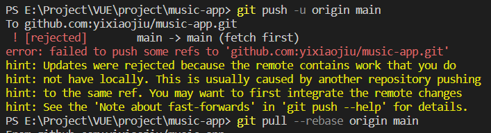
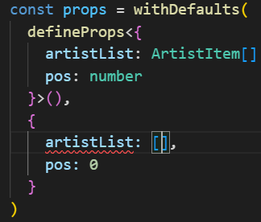

# 笔记

## unocss 的使用

### 使用纯 CSS 图标

```bash
npm i -D @unocss/preset-icons @iconify-json/[the-collection-you-want]
```

`the-collection-you-want`为图标库缩写

可以去[icons 官网](https://icones.js.org/)找需要的图标库

**例如**：Google Material Icons 的简写为`https://icones.js.org/collection/ic`地址最后的 ic

---

**图标的使用**

好像只能用`div`标签

图标的使用语法是`i+${图标集缩写名}+${图标名}`

以[Font Awesome Solid](https://icones.js.org/collection/fa6-solid)为例

```html
<div class="i-fa6-solid-user"></div>
```

## 移动端使用原生滚动

参考[知乎](https://zhuanlan.zhihu.com/p/24125823)

固定元素的高度

```CSS
.scroll-box {
  overflow: scroll;
  /* 隐藏滚动条 */
  margin-right: -20px;
  padding-right: 20px;
}
```

## 图片懒加载

> 使用`vueuse`中的`useIntersectionObserver`钩子

```VUE
app.directive('img-lazy', {
    mounted(el: HTMLImageElement, binding) {
      const { stop } = useIntersectionObserver(el, ([{ isIntersecting }], observerElement) => {
        if (isIntersecting) {
          el.src = binding.value
        }
      })
    }
  })
```

## v-loading 指令的实现

[v-loading](./src/utils/directive.ts)

## 工具包

- [汉字转拼音](https://www.npmjs.com/package/pinyin-pro)

## git 首次提交报错

参考[csdn](https://blog.csdn.net/qq_45893999/article/details/106273214)

> 原因：创建文件时添加了文件，进行了一次提交，导致两端都有文件，但这两份内容没有关系



**解决方法**

```bash
git pull --rebase origin main
```

## ts 类型报错



**解决方法**

```TypeScript
const props = withDefaults(
  defineProps<{
    artistList: ArtistItem[]
    pos: number
  }>(),
  {
    artistList: () => [],
    pos: 0
  }
)
```

## 播放器 icon

[阿里图标库](https://www.iconfont.cn/collections/detail?spm=a313x.7781069.1998910419.d9df05512&cid=27691)
